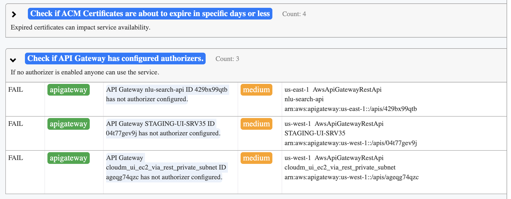

# prowler-viewer

This is a simplified viewer for prowler reports.

Prowler is an open-source cloud scanner.

Example report:

## How to use
Just open the viewer.html file in the browser. Then you will need to click on "select file" to select prowler report json file.

Depending on the report file size, you will see the report in a couple of seconds.
